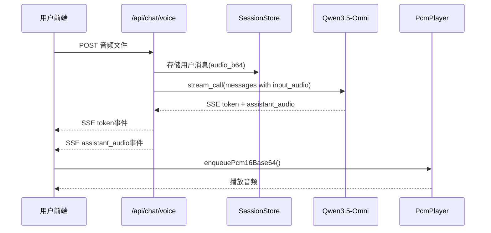

## 产品概述

实现基于 Qwen3.5-Omni 多模态模型的语音对话功能，语音直接作为输入传给模型，不经过独立 ASR 转文字步骤，模型同时返回文字和语音输出。

## 核心功能

- 语音消息：用户按住说话，音频直接传给 Omni 多模态模型，前端同时显示文字回复并播放语音
- 语音通话：通过 WebSocket 实现实时语音对话，用户说话时自动打断助手播放
- 音频播放：前端使用 PcmPlayer 播放模型返回的 PCM 音频流

## 技术栈

- 后端：FastAPI + OpenAI SDK（DashScope 兼容模式）+ Qwen3.5-Omni-Flash
- 前端：React 19 + TypeScript + Web Audio API + PcmPlayer
- 音频格式：PCM16 / WAV，采样率 24000Hz

## 实现方案

### 方案概述

将当前"ASR转文字 → 文字给Omni"的两步流程，改为"音频直接输入Omni → Omni同时返回文字+音频"的一步流程。

`omni_client.py` 已有完整支持：

- `build_messages()` 支持将 `audio_b64` 编码为 `input_audio` 格式
- `stream_call()` 支持 `modalities=["text","audio"]`，返回 `(text_delta, audio_b64)` 元组

需要修改的是调用层：`voice.py` 和 `call_ws.py`。

### 后端修改：`voice.py`

**修改内容**：

1. 移除 `asr_client` 导入和调用
2. 将原始音频 base64 编码后存入 session（`audio_b64` 字段已由 `session_store.add_message` 支持）
3. 使用 `omni_client.stream_call()` 替代 `stream_text()`
4. SSE 事件中新增 `assistant_audio` 事件

**关键代码**：

```python
async def generate():
    # 移除 ASR 调用，直接存音频
    user_msg = session_store.add_message(
        session_id,
        role="user",
        content="",  # 语音输入无文字
        source="voice",
        audio_bytes=audio_bytes,
        audio_format=fmt,
    )
    yield _sse("user_message", {"id": user_msg.id, "content": "[语音]", "role": "user", "source": "voice"})
    
    session = session_store.get(session_id)
    messages = omni_client.build_messages(session.messages)
    full_text: list[str] = []
    try:
        async for text_delta, audio_b64 in omni_client.stream_call(messages):
            if text_delta:
                full_text.append(text_delta)
                yield _sse("token", {"delta": text_delta})
            if audio_b64:
                yield _sse("assistant_audio", {"data": audio_b64, "sample_rate": 24000})
        assistant = session_store.add_message(session_id, role="assistant", content="".join(full_text), source="voice")
        yield _sse("done", {"message_id": assistant.id})
    except Exception as e:
        yield _sse("error", {"message": str(e)})
```

### 后端修改：`call_ws.py`

**修改内容**：

1. `handle_utterance` 中移除 ASR 调用
2. 音频已通过 `session_store.add_message(..., audio_bytes=pcm_bytes)` 存入 session
3. `build_messages()` 会自动将带 `audio_b64` 的用户消息编码为 `input_audio` 格式
4. `stream_call()` 已正确配置，无需修改调用方式

**关键修改**：

```python
async def handle_utterance(pcm_bytes: bytes) -> None:
    await cancel_current()
    async def run() -> None:
        # 移除 ASR 调用，直接存音频
        session_store.add_message(session_id, role="user", content="", source="call", audio_bytes=pcm_bytes, audio_format="wav")
        # 直接调 stream_call，build_messages 会自动处理 input_audio
        sess = session_store.get(session_id)
        messages = omni_client.build_messages(sess.messages)
        async for text_delta, audio_b64 in omni_client.stream_call(messages):
            if text_delta:
                await _send(ws, {"type": "assistant_token", "delta": text_delta})
            if audio_b64:
                await _send(ws, {"type": "assistant_audio", "data": audio_b64, "sample_rate": 24000})
```

### 前端修改：`ChatPage.tsx`

**修改内容**：

1. 引入 `PcmPlayer`，通过 ref 持有实例
2. `handleSseEvents` 新增 `assistant_audio` 事件处理
3. 助手新回复开始时停止上一轮播放
4. `done`/`error` 事件时停止播放

**关键代码**：

```
import { PcmPlayer } from "../audio/pcmPlayer";

export function ChatPage() {
  const playerRef = useRef(new PcmPlayer());
  
  // handleSseEvents 内新增：
  if (event === "assistant_audio") {
    const sampleRate = Number(data.sample_rate) || 24000;
    playerRef.current.enqueuePcm16Base64(String(data.data), sampleRate);
  }
  if (event === "done" || event === "error") {
    // 停止播放逻辑已在 PcmPlayer.stop() 中实现
  }
}
```

### 数据流图



## 目录结构

```
修改文件清单：

backend/app/api/voice.py          [MODIFY] 移除ASR，改用stream_call，新增assistant_audio事件
backend/app/gateway/call_ws.py    [MODIFY] 移除ASR调用，直接用stream_call
frontend/src/pages/ChatPage.tsx   [MODIFY] 引入PcmPlayer，处理assistant_audio事件
frontend/src/audio/pcmPlayer.ts   [引用] 已有，无需修改
backend/app/services/omni_client.py [引用] 已有完整支持，无需修改
backend/app/services/session_store.py [引用] 已有audio_b64字段，无需修改
```

## 设计风格

基于现有微信风格聊天界面，增加语音对话相关的视觉反馈，保持整体风格一致。

## 页面设计

### ChatPage - 聊天页面（增强）

**语音消息气泡**：

- 用户语音消息：显示🎤图标，标识为语音输入
- 助手语音消息：显示播放按钮▶️，点击可播放/暂停

**播放状态指示**：

- 助手正在播放语音时，消息气泡显示动态波形动画（CSS animation）
- 播放完毕后波形消失，显示普通文本

**通话按钮**：

- 已有📞按钮，点击进入 CallScreen
- 保持现有样式不变

### CallScreen - 语音通话页面（已有，无需修改）

- 深色背景（#1a1a1a），机器人头像
- 实时显示用户说话内容和助手回复
- 红色挂断按钮
- 通过 WebSocket + PcmPlayer 实时播放