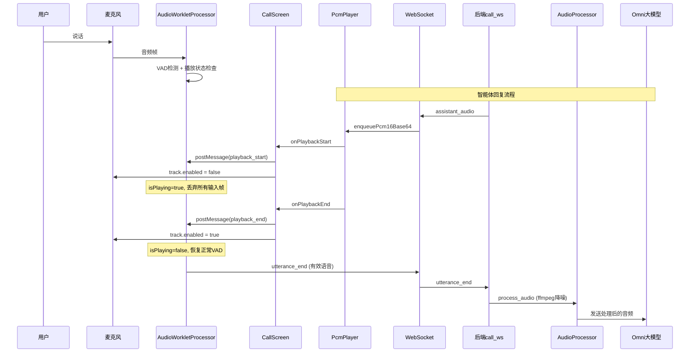

## 用户需求分析

### 问题背景

在双工语音实时对话场景中，智能体播放的语音通过扬声器输出后，被同一设备的麦克风重新捕获，形成回声回路。这导致：

- 用户语音中混入了智能体的回复声音
- 回声音频被发送给多模态大模型，导致智能体"听到自己的声音"
- 浏览器内置AEC（回声消除）已启用但效果不理想

### 核心需求

1. **前后端协同消除回声**：前端尽可能过滤回声，后端对残留回声进行二次处理
2. **前端有效语音判断**：只将有效语音段发送给后端，减少无效音频传输
3. **实时性要求**：双工对话场景下，处理延迟要尽可能低

### 核心功能

- **前端播放状态同步至AudioWorklet**：智能体播放音频时，AudioWorklet直接丢弃输入帧，从源头阻止回声被捕获
- **前端VAD增强**：提升语音活动检测精度，准确区分用户语音与背景噪音/回声
- **后端音频后处理**：使用ffmpeg对前端送达的音频进行降噪和回声消除处理
- **麦克风轨道双重保护**：播放期间禁用麦克风轨道，作为AudioWorklet过滤的备份机制
- **有效语音段检测**：基于能量阈值和持续时间，只发送符合条件的语音段给后端

## 技术栈

### 前端

- **Web Audio API / AudioWorklet**：实时音频处理，接收播放状态控制是否处理输入帧
- **MediaStreamTrack.enabled**：播放期间禁用麦克风轨道（双重保护）
- **WebSocket**：与后端保持实时双向通信

### 后端

- **FastAPI WebSocket**：接收前端音频数据
- **ffmpeg**（已有依赖）：音频后处理，使用 `afftdn`（频域降噪）和 `anlmdn`（非线性谱减降噪）过滤器
- **asyncio**：异步音频处理，避免阻塞WebSocket事件循环

---

## 实现方案

### 方案架构

```
用户说话 ──→ 麦克风 ──→ AudioWorkletProcessor
                                    │
                    ┌───────────────┤
                    │  播放状态？    │
                    │  (isPlaying)  │
                    └───────┬───────┘
                         是 │    │ 否
                            ▼    ▼
                        丢弃帧   VAD检测
                                    │
                        ┌───────────┤
                        │ 有效语音？ │
                        └────┬──────┘
                         是 │    │ 否
                            ▼    ▼
                        发送音频  丢弃
                                    │
                                    ▼
                              后端 call_ws.py
                                    │
                              audio_processor
                              (ffmpeg降噪)
                                    │
                                    ▼
                              发送给Omni大模型
```

### 前端实现

#### 1. 修改 `audio-worklet-processor.js`——播放状态感知

在AudioWorklet中维护 `isPlaying` 标志，通过 `port.onmessage` 接收来自 `CallScreen` 的播放状态通知：

- 收到 `playback_start` 消息时，设置 `this.isPlaying = true`，同时清空当前语音缓冲区（丢弃回声）
- 收到 `playback_end` 消息时，设置 `this.isPlaying = false`
- 在 `process()` 方法中，若 `this.isPlaying === true`，直接返回 `true` 而不处理输入帧（相当于静音输入）

```javascript
// audio-worklet-processor.js 核心改动
constructor() {
  super();
  this.isPlaying = false;  // 新增：播放状态标志
  this.state = "idle";
  // ... 其他现有字段
  
  this.port.onmessage = (e) => {
    if (e.data.type === "playback_start") {
      this.isPlaying = true;
      // 清空缓冲区，丢弃回声片段
      this.speechBuffer = [];
      this.state = "idle";
    } else if (e.data.type === "playback_end") {
      this.isPlaying = false;
    }
  };
}

process(inputs) {
  // 新增：播放期间直接丢弃所有输入帧
  if (this.isPlaying) {
    return true;
  }
  // ... 现有VAD逻辑
}
```

#### 2. 修改 `CallScreen.tsx`——播放状态同步

通过 `node.port.postMessage()` 向AudioWorklet发送播放状态：

- `onPlaybackStart` 触发时，发送 `{ type: "playback_start" }` 到AudioWorklet
- `onPlaybackEnd` 触发时，发送 `{ type: "playback_end" }` 到AudioWorklet
- 保留现有的麦克风轨道禁用逻辑，作为双重保护

```typescript
// CallScreen.tsx 核心改动
// 保存AudioWorkletNode引用，用于发送播放状态
const audioWorkletNodeRef = useRef<AudioWorkletNode | null>(null);

// 在设置AudioWorkletNode时保存引用
// node.port.onmessage 所在位置，同时保存 node 到 ref

// 修改 setupPlayerCallbacks：
player.onPlaybackStart = () => {
  console.log("[CallScreen] Playback started, disabling mic track + notify worklet");
  micTrack.enabled = false;
  agentTurnActive.current = true;
  ignoreVadUntil.current = Date.now() + 10000;
  
  // 新增：通知AudioWorklet开始播放
  audioWorkletNodeRef.current?.port.postMessage({ type: "playback_start" });
};

player.onPlaybackEnd = () => {
  console.log("[CallScreen] Playback ended, re-enabling mic track");
  agentTurnActive.current = false;
  
  // 新增：通知AudioWorklet播放结束
  audioWorkletNodeRef.current?.port.postMessage({ type: "playback_end" });
  
  // 恢复麦克风（移除500ms延迟，立即恢复）
  if (micTrack) {
    micTrack.enabled = true;
    ignoreVadUntil.current = 0;
  }
};
```

#### 3. 修改 `pcmPlayer.ts`——精确回调时机

确认 `onPlaybackStart` 和 `onPlaybackEnd` 在正确的时机触发：

- `onPlaybackStart`：在第一块音频调度播放时触发（现有实现已正确）
- `onPlaybackEnd`：在所有 `source.onended` 触发后、且 `activeSources.length === 0` 时触发（现有实现已正确）

无需修改，现有实现已满足需求。

#### 4. 增强VAD——有效语音判断

在 `audio-worklet-processor.js` 中增强现有VAD逻辑：

- 提高能量阈值精度：当前 `energyThreshold = 0.015`，可根据实际场景调整至 `0.02~0.03`
- 增加持续时间要求：`minSpeechFrames` 当前为12帧（约240ms），可增加至 `20~30帧`（400~600ms）以减少短噪音误触发
- 新增：在 `speechStart` 时，通过 `port.postMessage` 通知前端"检测到有效语音"，前端可用于UI提示

### 后端实现

#### 1. 创建 `backend/app/services/audio_processor.py`

使用ffmpeg的音频过滤器对音频进行后处理：

```python
import subprocess
import tempfile
from pathlib import Path

class AudioProcessor:
    """音频处理器：使用ffmpeg进行降噪和回声消除"""
    
    @staticmethod
    def process_audio(input_bytes: bytes, sample_rate: int = 16000) -> bytes:
        """
        处理音频字节数据，返回处理后的字节数据。
        使用 afftdn (频域降噪) 和 highpass/lowpass 过滤器。
        """
        with tempfile.NamedTemporaryFile(suffix=".wav", delete=False) as f_in, \
             tempfile.NamedTemporaryFile(suffix=".wav", delete=False) as f_out:
            # 写入输入WAV
            f_in.write(to_wav_bytes(input_bytes, sample_rate))
            f_in.flush()
            
            cmd = [
                "ffmpeg", "-y",
                "-i", f_in.name,
                "-af", "afftdn=nf=-20,highpass=f=80,lowpass=f=8000",
                "-ar", str(sample_rate),
                "-ac", "1",
                f_out.name
            ]
            subprocess.run(cmd, capture_output=True, check=True, timeout=5)
            
            return Path(f_out.name).read_bytes()
```

> **注意**：完整的WAV封装/解析代码需在实现时补充。`afftdn=nf=-20` 表示降噪量级为-20dB，可根据效果调整。

#### 2. 修改 `backend/app/gateway/call_ws.py`

在 `handle_utterance` 函数中，调用 `AudioProcessor.process_audio()` 对音频进行后处理：

```python
async def handle_utterance(pcm_bytes: bytes) -> None:
    await cancel_current()
    
    # 新增：服务端音频后处理（异步执行，避免阻塞）
    try:
        processed_bytes = await asyncio.to_thread(
            AudioProcessor.process_audio, pcm_bytes
        )
    except Exception:
        logger.warning("Audio processing failed, using original audio")
        processed_bytes = pcm_bytes  # 降级：使用原始音频
    
    async def run() -> None:
        # 使用 processed_bytes 而不是原始 pcm_bytes
        session_store.add_message(
            session_id,
            role="user",
            content="",
            source="call",
            audio_bytes=processed_bytes,  # 修改点
            audio_format="wav",
        )
        # ... 后续逻辑不变
```

---

## 架构设计

### 系统架构图



### 数据流

```
麦克风输入帧
    ↓
AudioWorkletProcessor.process()
    ↓
isPlaying == true ?
    ├─ 是 → 丢弃帧（返回true，不处理）
    └─ 否 → VAD检测
            ↓
        energy > threshold ?
            ├─ 是 → 累计speechFrames
            │       silenceFrames = 0
            │       speechBuffer.push(input)
            └─ 否 → silenceFrames++
                    silenceFrames >= maxSilenceFrames ?
                        ├─ 是 → finalize()
                        │       发送 utterance_end 到后端
                        └─ 否 → 继续
```

---

## 目录结构

```
前端修改文件：
frontend/public/
└── audio-worklet-processor.js    [MODIFY] 增加播放状态感知，播放期间丢弃输入帧

frontend/src/
├── audio/
│   └── pcmPlayer.ts              [MODIFY] 确认回调时机正确（可能无需改动）
├── components/
│   └── CallScreen.tsx            [MODIFY] 播放状态同步至AudioWorklet，移除麦克风恢复延迟

后端修改/新增文件：
backend/app/
├── services/
│   └── audio_processor.py        [NEW] 音频处理服务，使用ffmpeg降噪
└── gateway/
    └── call_ws.py                [MODIFY] handle_utterance中调用audio_processor处理音频
```

---

## 关键代码结构

### AudioWorkletProcessor 新增接口

```javascript
// audio-worklet-processor.js

// 构造函数中新增
this.isPlaying = false;
this.port.onmessage = (e) => {
  if (e.data.type === "playback_start") {
    this.isPlaying = true;
    this.speechBuffer = [];
    this.state = "idle";
  } else if (e.data.type === "playback_end") {
    this.isPlaying = false;
  }
};

// process() 方法新增（在现有逻辑之前）
process(inputs) {
  if (this.isPlaying) {
    return true;  // 播放期间直接丢弃所有输入帧
  }
  // ... 现有VAD逻辑
}
```

### CallScreen 播放状态同步

```typescript
// CallScreen.tsx
const audioWorkletNodeRef = useRef<AudioWorkletNode | null>(null);

// 在创建AudioWorkletNode时保存引用
const node = new AudioWorkletNode(ctx, "utterance-processor");
audioWorkletNodeRef.current = node;  // 新增

// setupPlayerCallbacks 中新增
player.onPlaybackStart = () => {
  micTrack.enabled = false;
  audioWorkletNodeRef.current?.port.postMessage({ type: "playback_start" });
};

player.onPlaybackEnd = () => {
  audioWorkletNodeRef.current?.port.postMessage({ type: "playback_end" });
  micTrack.enabled = true;  // 立即恢复，移除500ms延迟
};
```

---

## 性能优化

### 前端

- **AudioWorklet丢弃帧**：播放期间不分配任何缓冲区，开销极小（仅布尔检查）
- **麦克风轨道禁用**：浏览器级别静音，零CPU开销
- **VAD参数可调**：通过 `port.postMessage` 支持动态调整能量阈值

### 后端

- **ffmpeg处理异步化**：使用 `asyncio.to_thread` 避免阻塞事件循环
- **处理失败时降级**：ffmpeg处理失败时，降级使用原始音频，不影响通话流程
- **可选开关**：通过配置项 `ENABLE_SERVER_AUDIO_PROCESS` 控制是否启用服务端处理

---

## 测试策略

### 前端测试

1. **手动测试**：发起通话，观察智能体回复时前端是否继续向服务端发送音频（浏览器Network WS消息）
2. **VAD测试**：播放音乐时说话，验证只有人声被检测为有效语音
3. **跨浏览器测试**：Chrome、Firefox、Safari 验证 `echoCancellation` 约束和AudioWorklet兼容性

### 后端测试

1. **单元测试**：`AudioProcessor.process_audio()` 对已知带噪声音频的处理效果
2. **集成测试**：完整通话流程，验证音频经过处理后发送给Omni
3. **性能测试**：ffmpeg处理延迟（目标 < 100ms/utterance）

## Agent Extensions

### SubAgent

- **code-explorer**
- Purpose: 深度探索 `CallScreen.tsx` 中 `AudioWorkletNode` 的创建和使用位置，确认 `audioWorkletNodeRef` 的最佳注入点
- Expected outcome: 提供精确的代码修改位置和建议，确保播放状态能正确同步到AudioWorklet

### Skill

- **playwright-cli**
- Purpose: 自动化测试回声消除效果，模拟"智能体播放声音 + 麦克风捕获"的场景
- Expected outcome: 生成测试报告，验证前端AudioWorklet在播放期间是否正确处理输入帧